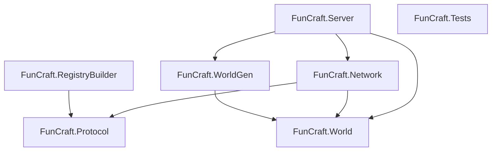
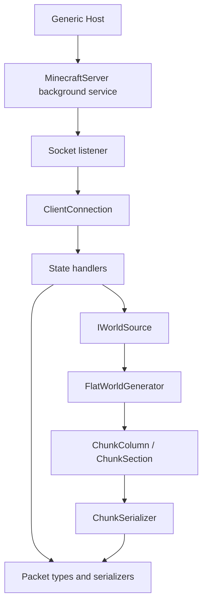

FunCraft is split into a small set of focused projects.

## Project dependency graph

## Project responsibilities

### `FunCraft.Server`

The executable entry point.

Responsibilities:

- bootstraps the generic host
- registers dependencies in the DI container
- loads bundled registry data before accepting traffic
- starts the network server as a hosted service

Important runtime wiring:

- `IWorldSource` is currently bound to `FlatWorldGenerator`
- `MinecraftServer` is registered as the hosted background service

### `FunCraft.Network`

The transport and state-management layer.

Responsibilities:

- raw socket listening
- accepting and tracking client connections
- reading and framing packets
- dispatching packets to handlers based on connection state
- sending server responses back to the client
- serializing chunk columns into protocol payloads

Key types:

- `MinecraftServer` — background TCP listener
- `ClientConnection` — per-connection read/write and state machine
- `HandshakeHandler`, `StatusHandler`, `LoginHandler`, `ConfigurationHandler`, `PlayHandler`
- `ChunkSerializer`

### `FunCraft.Protocol`

The wire-format layer.

Responsibilities:

- packet definitions
- protocol primitives such as `VarInt`, `VarLong`, and `McString`
- low-level `PacketReader` / `PacketWriter`
- protocol models such as the status ping payload
- loading bundled synchronized registry data from embedded resources

This project is the protocol vocabulary of the server.

### `FunCraft.World`

The in-memory world model.

Responsibilities:

- define block state types
- define chunk columns and chunk sections
- expose `IWorldSource` so the network layer can request chunk data without caring where it came from

### `FunCraft.WorldGen`

The current world implementation.

Responsibilities:

- generate a cached flat world
- satisfy `IWorldSource`

Right now it is intentionally simple: a deterministic flat terrain generator with per-column caching.

### `FunCraft.RegistryBuilder`

A separate utility used during development.

Responsibilities:

- read vanilla-generated registry JSON data
- convert selected synchronized registries into bundled binary data
- emit `registries.bin` for embedding into `FunCraft.Protocol`

This lets the runtime ship prebuilt registry data instead of regenerating it on server startup.

### `FunCraft.Tests`

The test project.

Responsibilities today are mostly around:

- registry packet sizing and framing
- NBT payload structure checks
- inspection helpers for registry content

## Runtime architecture

## Startup sequence

At startup, the server follows this rough order:

1. build the host
2. register `IWorldSource -> FlatWorldGenerator`
3. register `MinecraftServer`
4. call `RegistryLoader.Load()`
5. start the host and begin listening for TCP connections

That means registry data is expected to be present and valid before the server starts accepting clients.

## Design characteristics

### What is good about the current structure

- projects are separated by responsibility
- the world source is abstracted from the network layer
- packet code is isolated from socket code
- state handling is split by protocol phase instead of becoming one giant switch statement from hell

### What is still rough

- there is little shared domain state beyond packet flow
- many values are hardcoded rather than modeled
- protocol version concerns are scattered across packet classes, world assumptions, and docs
- error handling and diagnostics are still lightweight

## Suggested architectural direction

A sensible next evolution would be:

1. introduce a player/session domain model
2. centralize protocol-version-dependent constants
3. add a world service boundary for chunk caching and persistence
4. replace hardcoded packet payload values with configuration or runtime data
5. strengthen logging around state transitions and packet dispatch

