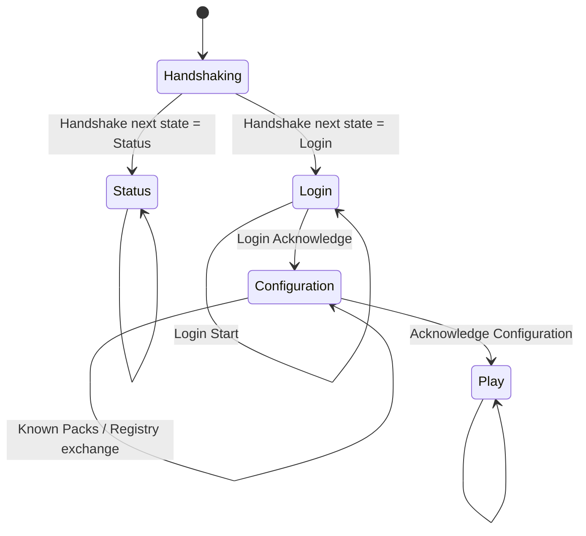
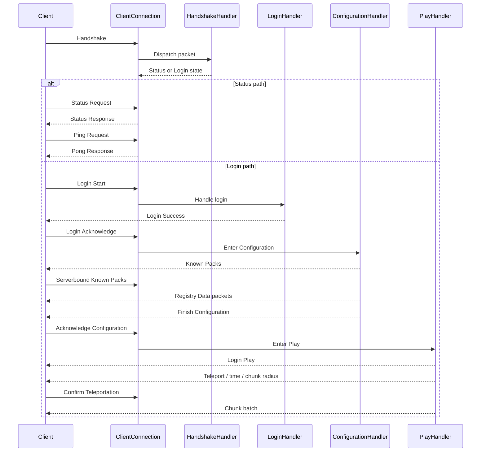

# Connection Lifecycle

FunCraft uses an explicit connection-state machine.

## State diagram

## Connection flow

### 1. Socket acceptance

`MinecraftServer` accepts a raw TCP socket and creates a `ClientConnection`.

### 2. Packet framing

`ClientConnection` uses:

- a `Pipe` for buffered reads
- `VarInt` packet length prefixes
- `VarInt` packet IDs

Incoming data is split into individual packets before dispatch.

### 3. State-based dispatch

Each packet is routed according to the current `ConnectionState`:

- `Handshaking`
- `Status`
- `Login`
- `Configuration`
- `Play`

The connection only changes state when a handler explicitly returns a different state.

## Sequence diagram

# State-by-state behavior

## Handshaking
Implemented in `HandshakeHandler`.

Supported behavior:
- read `HandshakePacket`
- inspect `NextState`
- switch to `Status` or `Login`

Anything malformed or unexpected leaves the connection in `Handshaking`.

## Status
Implemented in `StatusHandler`.

Handled packets:

| Packet | Direction | ID | Behavior |
| --- | --- | --: | --- |
|`StatusRequestPacket`|client -> server|`0x00`|returns JSON server status|
|`PingRequestPacket`|client -> server|`0x01`|echoes payload in `PongResponsePacket`|

Current status payload is hardcoded:
- version name: `1.21.10`
- protocol: `773`
- max players: `100`
- online players: `0`
- description: `A FunC#raft Server`

## Login

Implemented in `LoginHandler`.
Handled packets:

|Packet|Direction|ID|Behavior|
|---|---|--:|---|
|`LoginStartPacket`|client -> server|`0x00`|reads player name + GUID, sends `LoginSuccessPacket`|
|`LoginAcknowledgePacket`|client -> server|`0x03`|moves connection to `Configuration`|

Current login behavior is minimal:
- no Mojang/Microsoft authentication
- no encryption request flow
- no compression negotiation
- no player validation beyond parsing the packet

## Configuration
Implemented in `ConfigurationHandler`.

Entry behavior:
- immediately sends `KnownPacksPacket`

Handled packets:

|Packet|Direction|ID|Behavior|
|---|---|--:|---|
|`ServerboundKnownPacksPacket`|client -> server|`0x07`|sends all bundled registry packets, then `FinishConfigurationPacket`|
|`AcknowledgeConfigurationPacket`|client -> server|`0x03`|moves connection to `Play`|
This is where the server synchronizes registries using the embedded `registries.bin` resource.

## Play
Implemented in `PlayHandler`.

### On entering Play
The handler sends:
1. `LoginPlayPacket`
2. `SynchronizePlayerPositionPacket`
3. `SetCenterChunkPacket`
4. `SetChunkCacheRadiusPacket`
5. `UpdateTimePacket`
6. starts a keep-alive loop

### After teleport confirmation

When the first `ConfirmTeleportationPacket` arrives, the server:

- marks spawn as acknowledged
- sends a `GameEventPacket`
- begins a chunk batch
- streams a fixed radius of chunks around `(0, 0)`
- ends the chunk batch

### Current Play-state assumptions
- fixed teleport ID: `1`
- fixed spawn: `(0.5, 65.0, 0.5)`
- fixed view distance radius: `2`
- fixed time of day: `6000`
- keep-alive interval: `10 seconds`

### Packets currently handled in Play

|Packet|Direction|ID|Behavior|
|---|---|--:|---|
|`ConfirmTeleportationPacket`|client -> server|`0x00`|triggers initial chunk send once|
|`ServerboundKeepAlivePacket`|client -> server|`0x1B`|verifies keep-alive response|
|`ChunkBatchReceivedPacket`|client -> server|`0x0A`|logs requested chunks per tick|
Several high-frequency movement/input packets are explicitly ignored for now.

## Important implementation detail
`ClientConnection` uses `OnStateEnteredAsync` hooks when a state changes. Right now those hooks exist for:
- `Configuration`
- `Play`

That keeps the state transition logic separate from the per-packet logic, which is a good pattern to preserve as the server grows.