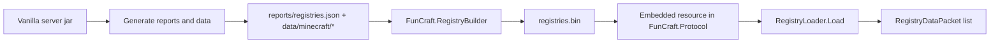

FunCraft ships synchronized registry data as an embedded binary resource: `registries.bin`.

This document replaces the older rough note about generating registries and explains the full workflow more cleanly.

## Why this exists

Modern Minecraft protocol includes synchronized registry data during the Configuration phase.

FunCraft does not build that data live on startup. Instead, it:

1. extracts registry information from vanilla-generated data
2. converts selected JSON registry payloads into network NBT
3. bundles everything into `FunCraft.Protocol/Resources/registries.bin`
4. embeds that file into `FunCraft.Protocol`
5. loads it at runtime through `RegistryLoader`

## Pipeline overview



## Step 1: obtain the vanilla server jar
Use the Minecraft launcher or the official server distribution flow to download the server jar for the exact version you want to target.
For the current codebase, that version is intended to be **1.21.10**.
Keep the jar in its own working directory so the generated output stays organized.

## Step 2: generate the vanilla data output
From the directory containing the server jar, run:

```shell
java -jar server.jar --bundlerRepoDir . nogui
```

Then run:

```shell
java "-DbundlerMainClass=net.minecraft.data.Main" -jar server.jar --all --output generated
```

This creates a `generated/` directory containing:
- `reports/registries.json`
- many JSON files under `data/minecraft/...`

Those files are the source input for `FunCraft.RegistryBuilder`.

## Step 3: run `FunCraft.RegistryBuilder`
Build the utility and execute it with:
```shell
FunCraft.RegistryBuilder.exe <generated-folder> <output-file>
```

Example:
```shell
FunCraft.RegistryBuilder.exe .\generated .\output\registries.bin
```

The tool expects:
- the generated folder to exist
- `reports/registries.json` to be present
- the output path to be a file path, not just a directory

## What the builder actually does
`RegistryBundler` performs two jobs.

### 1. Collect registry entries in protocol order
It reads `reports/registries.json` and sorts entries by `protocol_id`.
That is important because packet ordering and numeric IDs must match the protocol expectations.

### 2. Add NBT-backed registry payloads where needed
For selected registries, the builder also reads JSON files from `data/minecraft/...` and converts them into network NBT payloads.

Registries with NBT payload support in the current code include examples such as:
- `minecraft:dimension_type`
- `minecraft:worldgen/biome`
- `minecraft:damage_type`
- `minecraft:chat_type`
- `minecraft:banner_pattern`
- `minecraft:wolf_variant`
- `minecraft:painting_variant`
- `minecraft:trim_material`
- `minecraft:trim_pattern`
- `minecraft:instrument`
- `minecraft:jukebox_song`
- several animal variant registries

## Schema inference and NBT conversion
The builder does not hardcode every field shape manually.

Instead:
- `SchemaAnalyzer` walks registry JSON files
- infers an NBT-friendly schema per registry
- resolves some type conflicts using field-name heuristics
- `NbtBinaryWriter` writes network NBT payloads from JSON values

The output format used here is network NBT suitable for the protocol flow this project targets.

## Runtime loading

At runtime:
1. `RegistryLoader.Load()` reads the embedded `registries` resource
2. it reconstructs the registry packet list
3. `ConfigurationHandler` sends those packets during the Configuration phase

So the registry builder is a development-time tool, while `RegistryLoader` is the runtime consumer.

## Current bundled registry snapshot

Based on the current `registries.bin` file in the repository:
- total registries bundled: `107`
- registries carrying NBT payloads: selected subset only
- total NBT payload bytes bundled: `205074`

A few notable bundled registries with NBT payloads include:

|Registry|Entries with NBT|
|---|---|
|`minecraft:dimension_type`|4|
|`minecraft:worldgen/biome`|65|
|`minecraft:damage_type`|49|
|`minecraft:chat_type`|7|
|`minecraft:painting_variant`|51|
|`minecraft:jukebox_song`|21|

## Updating registries safely

Whenever the target Minecraft version changes:
1. regenerate vanilla data from the new jar
2. rebuild `registries.bin`
3. verify packet behavior and chunk assumptions
4. re-check block state IDs in `WellKnownBlocks`
5. update documentation and version strings together

If you skip step 4, you can end up with a charming little nightmare where the server and client agree on the protocol number but disagree on what a block actually is.