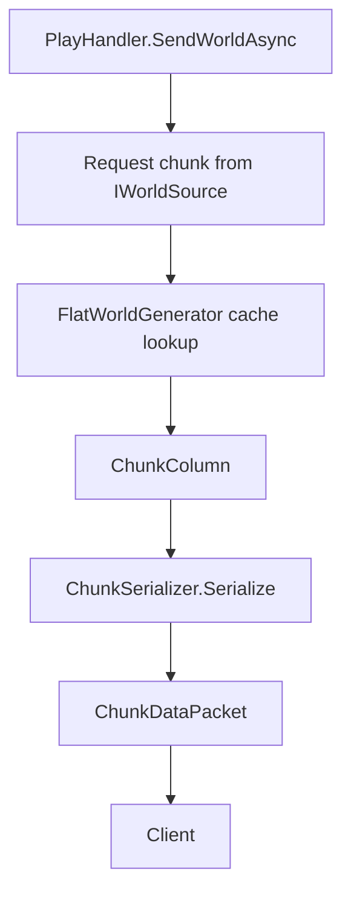

This document explains how FunCraft models the world and turns it into packet data.

## World abstraction
The network layer depends on the `IWorldSource` interface:

```csharp
ChunkColumn GetChunk(int chunkX, int chunkZ)
```

That is a useful boundary because the connection code does not care whether a chunk came from:
- a procedural generator
- a save file
- a database
- a cache
- a remote service

Right now the concrete implementation is `FlatWorldGenerator`.

## Chunk model
### `ChunkColumn`
A chunk column represents a full vertical slice of the world.

Current assumptions in code:
- size: `16 x 384 x 16`
- section count: `24`
- world min Y: `-64`
- world max Y: `319`

Each column contains 24 `ChunkSection` objects.

### `ChunkSection`
A chunk section is a `16 x 16 x 16` cube.

Each section stores:
- a `BlockState[]` array with 4096 entries
- a running count of non-air blocks

That running count is used to:
- report `BlockCount`
- detect empty sections efficiently
- allow single-valued palette optimizations

## Block model
`BlockState` is currently a very small value type that wraps a `ushort` block state ID.

`WellKnownBlocks` provides a few verified IDs, including:
- air
- stone
- grass block
- dirt
- bedrock

These IDs are protocol-sensitive. If the server version changes and the registry dump changes, block IDs must be revalidated.

## Flat world generation
`FlatWorldGenerator` caches generated chunk columns in a `ConcurrentDictionary`, so each `(chunkX, chunkZ)` pair is generated once and then reused.

## Actual generated layer layout
The code currently generates these absolute Y layers:



## Chunk serialization
`ChunkSerializer` converts a `ChunkColumn` into the payload expected by `ChunkDataPacket`.

The serializer currently writes:
1. heightmaps
2. chunk section data
3. block entity list
4. light data

## Heightmaps
Two heightmaps are written:
- `MOTION_BLOCKING`
- `WORLD_SURFACE`

Both are derived by scanning downward per `(x, z)` column until the first non-air block is found.

## Block state container strategy
For each section, the serializer chooses one of these modes:
- single-valued palette, if the whole section is the same block
- indirect palette, if the unique block count fits compactly
- direct/global palette, if the section needs more bits per entry

This is the right general strategy for Minecraft chunk encoding and keeps bandwidth lower than a naive full-width encoding.

## Biomes
Biome data is currently serialized as a single-valued biome container.

Current assumption:
- all biomes are `plains`
- biome registry ID used is `0`

That is fine for an early prototype, but it means the world has no biome variation.

## Block entities
Block entities are currently omitted.

The serializer writes:
- block entity count = `0`

## Lighting
The serializer currently sends empty light arrays and marks sections as empty in the light masks.
That keeps the implementation simple, but it also means lighting behavior is intentionally incomplete.

## Initial chunk radius
The play handler currently sends a radius of `2`, which means:
- `(2r + 1)^2 = 25` chunk columns
- coordinates from `-2` to `+2` in both axes

This is a fixed bootstrap value, not yet a per-player or per-client setting.

## Where to extend next
Natural next improvements here would be:
- richer world generation
- biome-aware chunk serialization
- real lighting data
- block entity support
- chunk persistence and invalidation
- view-distance negotiation based on client/server settings